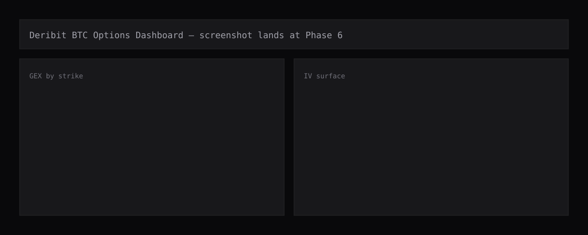

# Deribit BTC Options Dashboard

Live dealer gamma, vol surface, and skew dashboard for BTC options on Deribit, in your browser, no backend.

> **Live demo:** _added when Phase 6 completes (GitHub Pages)_



## What this is

Static HTML + vanilla ES2022 modules. Plotly for charts, Tailwind for layout. The browser fetches Deribit's public REST API directly (CORS-enabled) and computes everything locally — Black-Scholes greeks, SVI vol surface fits, gamma exposure curves, max pain, skew metrics. No build step, no transpiler, no backend. View source on every line.

## Why this exists

Crypto options sit at an awkward intersection: liquid enough for serious flow analysis, but the dealer-positioning literature was written for SPX. SqueezeMetrics' GEX framework assumes a stable dealer cohort that's net-short calls and net-long puts. On Deribit, that cohort is more heterogeneous — the venue serves prop, retail, and a smaller dealer book than CBOE — which makes the canonical sign convention more fragile. This dashboard implements the canonical math honestly, then lays out exactly where the assumption gets thin. The methodology page does not hand-wave.

The math is the project. The polish is the cover. If a recruiter clicks `js/gex.js` and finds an uncommented `mark_iv * something` line, the dashboard fails its job. Every formula cites a source.

## Features

| Feature | Status | Module |
|---|---|---|
| Deribit REST client | ✅ Phase 0 | `js/deribit.js` |
| Raw-data dump page | ✅ Phase 0 | `tests/test_deribit_dump.html` |
| Black-Scholes pricing + greeks | ✅ Phase 1 | `js/black_scholes.js` |
| Dealer GEX + zero-gamma flip | ✅ Phase 2 | `js/gex.js` |
| SVI per-expiry fit | ✅ Phase 3 | `js/svi.js` |
| 3D IV surface + slices | ✅ Phase 3 | `js/plots/iv_surface.js` |
| Per-expiry forwards F | ✅ Phase 3 | `js/forwards.js` |
| ATM IV term structure | ✅ Phase 4 | `js/term_structure.js` |
| 25Δ RR + BF | ✅ Phase 4 | `js/skew.js` |
| Max pain | ⏳ Phase 5 | `js/max_pain.js` |

## Math

Every formula on the dashboard is derived in [`docs/METHODOLOGY.md`](docs/METHODOLOGY.md). Highlights:

- **GEX**: `γ × OI × contract_size × spot² × 0.01`, sign +calls / −puts (SqueezeMetrics 2017). Zero-gamma flip computed by scanning hypothetical spot ±20% in 0.5% steps.
- **Black-Scholes**: standard, `r=0` (crypto, no risk-free rate). Hand-implemented in `js/black_scholes.js`, unit-tested against published values.
- **SVI**: Gatheral raw parameterization `w(k) = a + b·(ρ·(k−m) + √((k−m)² + σ²))`, fit per expiry by Nelder-Mead with no-arb constraints enforced via penalty.
- **Forward**: per-expiry F sourced from Deribit BTC futures of matching expiry, used in `k = log(K/F)`.
- **25Δ skew**: `RR = IV_25c − IV_25p`, `BF = (IV_25c + IV_25p)/2 − IV_ATM`.
- **Max pain**: argmin over candidate-strike grid of total option-holder loss at each candidate.
- **OI-weighted P/C**: `Σ put_OI / Σ call_OI` per expiry and aggregate.

## Limitations (read this before drawing conclusions)

- **No historical replay.** Snapshot only.
- **Mark IV from Deribit's mark, not own bid/ask.** Mark IV smooths through wide spreads and can lag in fast markets.
- **Dealer assumption is a simplification.** Deribit's flow is not SPX. The sign convention (+calls, −puts) is the SqueezeMetrics canonical view; real dealer books are heterogeneous and the assumption is more brittle on a venue with significant prop flow.
- **SVI may diverge for very short-dated expiries** (< 24h) where the smile is dominated by gamma kinks. Fit residuals are surfaced per expiry — if they're large, don't read the curve.
- **`r = 0` for BTC.** Documented, not snuck in.
- **No greeks beyond gamma + delta + vega.** Theta isn't shown; not needed for any visualisation here.

## Performance

- Cold load: ~2s to first plot on a typical broadband connection.
- Steady state: 1 instruments-list call (cached 5min) + 2 book-summary calls (options + futures) + 1 index call per refresh = 4 HTTP requests per 30s tick.
- Memory: < 50MB resident.

(Numbers refreshed per phase.)

## Repo layout

```
deribit-options-dashboard/
├── index.html
├── docs/METHODOLOGY.md
├── js/
│   ├── deribit.js
│   ├── black_scholes.js
│   ├── svi.js
│   ├── gex.js
│   ├── max_pain.js
│   ├── skew.js
│   ├── term_structure.js
│   ├── main.js
│   └── plots/
├── tests/                # browser-runnable test pages
└── assets/
```

## Running locally

```bash
git clone https://github.com/QuantMaverick/deribit-options-dashboard
cd deribit-options-dashboard
python3 -m http.server 8080      # any static file server works
open http://localhost:8080/
```

## Citations

- Black & Scholes (1973), _The Pricing of Options and Corporate Liabilities_.
- Gatheral, J. (2004), _A parsimonious arbitrage-free implied volatility parameterization with application to the valuation of volatility derivatives_.
- SqueezeMetrics (2017), _The implied order book and gamma exposure_.
- Hull, J.C. (2017), _Options, Futures, and Other Derivatives_, 11th ed., Pearson.

## License

MIT — see [LICENSE](LICENSE).

## Contact

QuantMaverick — [github.com/QuantMaverick](https://github.com/QuantMaverick)
