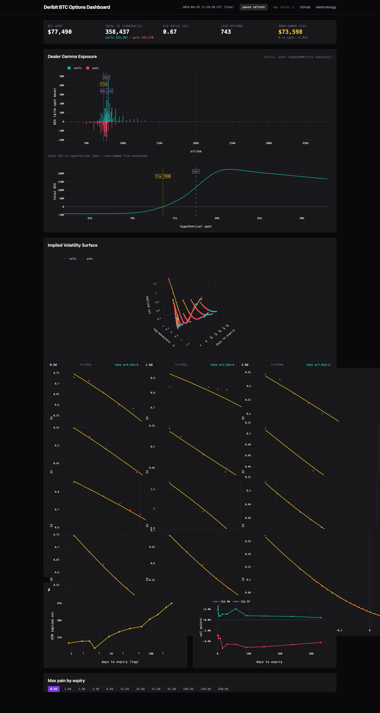

# Deribit BTC Options Dashboard

Live dealer gamma, vol surface, and skew dashboard for BTC options on Deribit, in your browser, no backend.

**🔗 Live demo:** https://jothamteo.github.io/deribit-options-dashboard/



## What this is

Static HTML + vanilla ES2022 modules. Plotly for charts, Tailwind via CDN. The browser fetches Deribit's public REST API directly (CORS-enabled) and computes everything locally — Black-Scholes greeks, SVI vol surface fits, gamma exposure curves, max pain, 25Δ skew. **No build step, no transpiler, no backend.** View source on every line.

## Why this exists

Crypto options sit at an awkward intersection: liquid enough for serious flow analysis, but the dealer-positioning literature was written for SPX. SqueezeMetrics' GEX framework assumes a stable dealer cohort that's net-short calls and net-long puts. On Deribit, that cohort is more heterogeneous — the venue serves prop, retail, and a smaller dealer book than CBOE — which makes the canonical sign convention more fragile. This dashboard implements the canonical math honestly, then lays out exactly where the assumption gets thin. The methodology page does not hand-wave.

The math is the project. The polish is the cover. Every formula cites a source.

## Features

| Feature | Status | Module |
|---|---|---|
| Deribit REST client | ✅ | [`js/deribit.js`](js/deribit.js) |
| Black-Scholes greeks | ✅ | [`js/black_scholes.js`](js/black_scholes.js) |
| Dealer GEX + zero-gamma flip | ✅ | [`js/gex.js`](js/gex.js) |
| Per-expiry forwards F | ✅ | [`js/forwards.js`](js/forwards.js) |
| SVI fit (Gatheral 2004 raw) | ✅ | [`js/svi.js`](js/svi.js) |
| 3D IV surface + slice grid | ✅ | [`js/plots/iv_surface.js`](js/plots/iv_surface.js) |
| ATM IV term structure | ✅ | [`js/term_structure.js`](js/term_structure.js) |
| 25Δ Risk-Reversal + Butterfly | ✅ | [`js/skew.js`](js/skew.js) |
| Max pain (per-expiry) | ✅ | [`js/max_pain.js`](js/max_pain.js) |
| Browser-runnable test pages | ✅ | [`tests/`](tests/) |
| KaTeX-rendered methodology | ✅ | [`docs/methodology.html`](docs/methodology.html) |

## Math

Every formula on the dashboard is derived in **[Methodology](docs/methodology.html)** (LaTeX-rendered with KaTeX). Highlights:

- **Black-Scholes**: `d₁ = (ln(S/K) + (r − q + σ²/2) T) / (σ √T)`. `r = q = 0` for BTC ([why](docs/methodology.html#1.4)). `N(x)` via Abramowitz-Stegun 26.2.17, max abs error ~7.5e-8. Hand-implemented in `js/black_scholes.js`, unit-tested against Hull 11ed §15.7 and Python erf-based reference values.
- **GEX**: `Γ × OI × contractSize × S² × 0.01 × ε`, with `ε = +1` calls / `−1` puts (SqueezeMetrics 2017). Zero-gamma flip computed by scanning hypothetical spot ±20% in 0.5% steps and locating the cumulative-GEX sign change.
- **SVI**: Gatheral raw parameterization `w(k) = a + b·(ρ·(k−m) + √((k−m)² + σ²))`, fit per expiry by hand-rolled Nelder-Mead with no-arb constraints enforced via soft penalty. No scipy, no pyodide, no `fmin` libs.
- **Forward F**: per-expiry `F` sourced from Deribit BTC futures of matching expiry (linear interp if no exact match). Used in `k = ln(K/F)`.
- **25Δ skew**: spot-delta matching, `RR = IV_25c − IV_25p`, `BF = (IV_25c + IV_25p)/2 − IV_ATM` where IV_ATM = √(w(0)/T) from the SVI fit.
- **Max pain**: argmin over candidate-strike grid of total option-holder loss at each candidate.
- **OI-weighted P/C**: `Σ put_OI / Σ call_OI` per expiry and aggregate.

## Performance

- **Cold load**: ~1.5–2 s to first plot on broadband. `<link rel="preconnect">` to Deribit and the CDNs warms TCP+TLS during HTML parse.
- **Steady-state per refresh**: 3 HTTP calls (index price, options book summary, futures book summary). Both instruments lists cached 5 min in sessionStorage. Total ~0.10 req/s — well under Deribit's public limit.
- **CPU per tick**: ~30–80 ms typical (~1500 options × 41-point GEX scan, plus ~10 expiries × Nelder-Mead SVI fit). Halved from Phase 5 by tightening the GEX scan grid (1 % steps; the linear interp in `findZeroGammaFlip` resolves below grid spacing anyway).
- **Render order**: cheap 2D charts paint first (GEX, slice grid, term structure, RR/BF, max pain); the heavy 3D IV surface is deferred to the next animation frame so it never blocks above-fold paint.
- **Progressive render**: GEX paints from the first 3 fetches; IV surface and skew paint after futures resolve. A failing futures call doesn't blank out GEX.
- **Plotly is `defer`-loaded** so it doesn't block HTML parse; main.js polls `window.Plotly` before any `Plotly.react` call, with a 10 s timeout.
- **Memory**: < 50 MB resident.

## Limitations (read this before drawing conclusions)

- **No historical replay.** Snapshot only.
- **Mark IV from Deribit's mark, not own bid/ask.** Mark IV smooths through wide spreads and can lag in fast markets.
- **Dealer assumption is a simplification.** Deribit's flow is not SPX. The sign convention (+calls, −puts) is the SqueezeMetrics canonical view; real dealer books are heterogeneous and the assumption is more brittle on a venue with significant prop flow. See [Methodology §3.3](docs/methodology.html#3.3).
- **SVI may diverge for very short-dated expiries** (< 24h) where the smile is dominated by gamma kinks. Per-expiry fit RMSE is exposed in the slice grid header — if it's amber instead of teal, don't read the SVI curve there.
- **Multi-expiry no-arb (calendar / butterfly across expiries) is NOT enforced.** Each expiry fits independently. SSVI / surface SVI is overkill for visual purposes.
- **`r = 0` for BTC.** Documented, not snuck in.
- **3D IV surface needs WebGL.** Mobile / in-app browsers may show a fallback.

## Repo layout

```
deribit-options-dashboard/
├── index.html                     # entry, dark-mode dashboard
├── docs/
│   ├── METHODOLOGY.md             # source-of-truth math doc
│   └── methodology.html           # KaTeX-rendered companion page
├── js/
│   ├── main.js                    # refresh loop + render dispatch
│   ├── deribit.js                 # REST client w/ rate budget + cache
│   ├── black_scholes.js           # BS price + Δ + Γ + ν
│   ├── forwards.js                # per-expiry F from futures curve
│   ├── svi.js                     # Gatheral SVI + Nelder-Mead simplex
│   ├── gex.js                     # dealer GEX + zero-gamma scan
│   ├── term_structure.js          # ATM IV from SVI(k=0)
│   ├── skew.js                    # 25Δ RR + BF
│   ├── max_pain.js                # per-expiry pain curve + argmin
│   └── plots/
│       ├── gex_chart.js
│       ├── iv_surface.js
│       ├── term_structure_chart.js
│       └── max_pain_chart.js
├── tests/                         # browser-runnable test pages, no Node
│   ├── test_black_scholes.html    # 30+ assertions vs Hull / erf-truth
│   ├── test_gex.html              # 22 assertions
│   ├── test_svi.html              # 25 assertions, NM + Rosenbrock
│   ├── test_skew.html             # 17 assertions
│   ├── test_max_pain.html         # 16 assertions, hand-computed
│   └── test_deribit_dump.html     # raw-data shape verifier
└── assets/
    ├── favicon.svg
    └── screenshot.png
```

## Running locally

```bash
git clone https://github.com/jothamteo/deribit-options-dashboard
cd deribit-options-dashboard
python3 -m http.server 8080      # any static file server works
open http://localhost:8080/
```

## Tests

Each browser-runnable test page is independently linked from the dashboard footer. Open any of them in a browser; passes are teal, fails are rose. No headless runner, no Node, no Jest. The pattern keeps tests inspectable: a recruiter can read the assertion table and see Got, Expected, Δ-abs, and tolerance for every check.

## Citations

- Black, F. and Scholes, M. (1973). _The Pricing of Options and Corporate Liabilities_. Journal of Political Economy, 81(3): 637–654.
- Gatheral, J. (2004). _A parsimonious arbitrage-free implied volatility parameterization with application to the valuation of volatility derivatives_. Madrid Quant Congress.
- SqueezeMetrics (2017). _The Implied Order Book and Gamma Exposure_.
- Hull, J. C. (2017). _Options, Futures, and Other Derivatives_, 11th edition. Pearson.
- Nelder, J. A. and Mead, R. (1965). _A simplex method for function minimization_. The Computer Journal, 7(4): 308–313.
- Abramowitz, M. and Stegun, I. (1964). _Handbook of Mathematical Functions_. National Bureau of Standards.

## License

MIT — see [LICENSE](LICENSE).

## Contact

jothamteo — [github.com/jothamteo](https://github.com/jothamteo)
